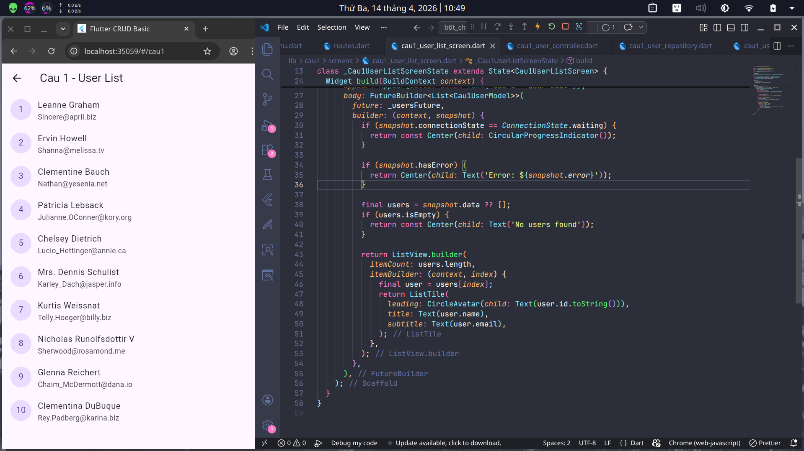
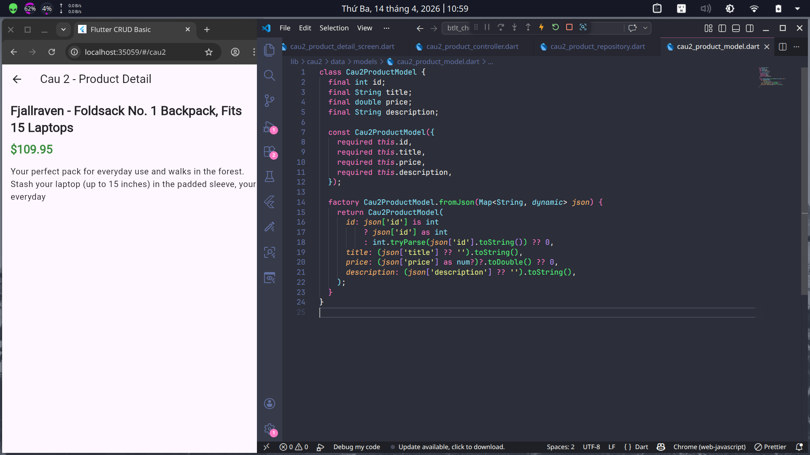
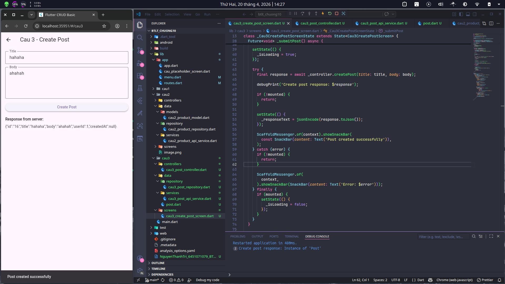

# BTLT CHƯƠNG 10: API

- Họ và tên: Nguyễn Thành Trí
- MSSV: 6451071079
- Lớp: CQ.CNTT.64

## Hướng dẫn chạy project

```bash
flutter pub get
flutter run
```

# Câu 1: Fetch User List (GET API)



# Câu 2: Product detail (GET + JSON Parse)



# Câu 3:



# Câu 4:


# Câu 5:


# Câu 6:


# Câu 7:


